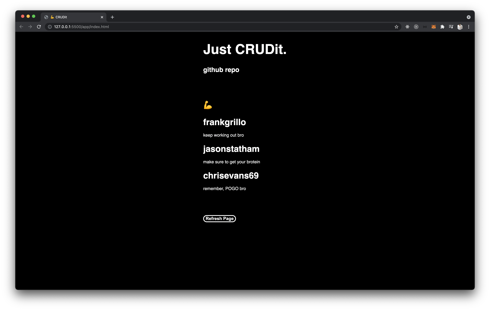

# Crudit

An app to help gym bros encourage each other to pump.\
A simple project to practice building CRUD functionality in PostgreSQL.


## Quick start

Open `index.html` in the `app` folder for client side.\
You will need to build a local copy of a PSQL DB instance called `notes`.\
To run the server side, run these commands.

```
knex migrate:latest
knex seed:run
cp .env .env.example
npm install
npm start
```

API endpoints:

- /api/notes ---> GET
- /api/post ---> POST
- /api/put ---> PUT
- /api/delete ---> DELETE

## Technologies used

HTML\
CSS\
JavaScript\
[Knex.js](https://knexjs.org/)\
[PostgreSQL](https://www.postgresql.org/)
